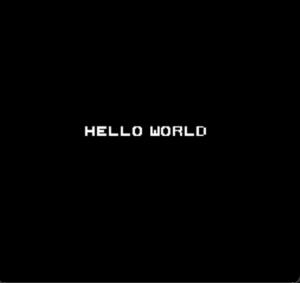

# fTNES

Currently a 6502 microprocessor but working on PPU   
to emulate Nintendo Entertainment System(NES), written in C  
Likely will remain unfinished TBH

## Features

- Full emulation of the legal CPU opcodes
- Emulation of primary system components I/O
- Support for NROM, non memory-mapped
- Rendering of OAM Sprites

### Prerequisites

- A C 64-bit compiler (ex. GCC, Clang, MSVC)
- Simple DirectMedia Layer (SDL2)
- Basic make and lib linking knowledge

### Building

```mingw32-make``` ```make```

### Running

```
./main path_to_bin or 'mingw32-make run'
```

<table>
<tr>
<td>


</td>
<td>



</td>
</tr>
</table>


## Roadmap

- ~~Implement primary opcodes~~
- Timings ~~and Interrupts~~
- Finish OAM and Nametables
- Cont. PPU Registers
- Streamline build

## Acknowledgments

- nesdev.org - obelisk's guide - Andrew Jacobs
- as65 - assembler by Andrew Jacobs
- masswerk.at - 6502 instruction set reference
- ca65 - Assembler by Ullrich von Bassewitz, Greg King
- hex editor - hexed.it ♡
- NES Documentation - Patrick Diskin 2004
- mcs6500 family programming manual

